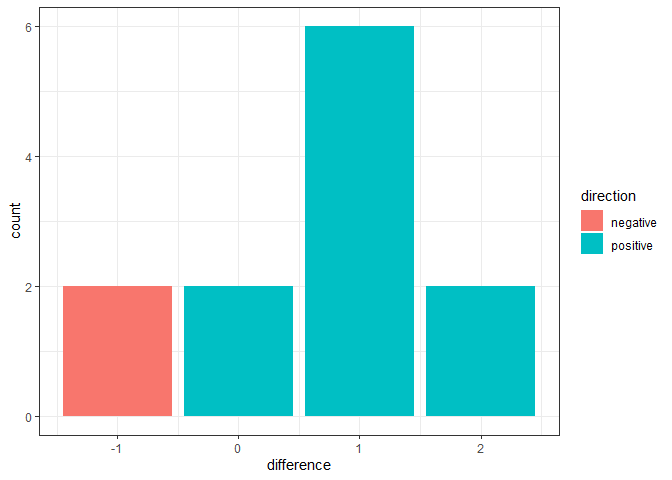

Rock climbing survey data analysis
================
Sunny
2023-03-07

### R packages

``` r
library(tidyverse)
library(knitr)
library(here)
library(coin)
```

### Other functions

``` r
wilcox_table <- function(dataset, question_id){
  
  wilcox <- dataset %>%
  select(`Respondent ID`, question_id, `survey`) %>%
  mutate_at(c(2), ~recode(., "Strongly Agree" = 4,
                          "Strongly agree" = 4,
                          "Agree" = 3,
                          "Disagree" = 2,
                          "Strongly Disagree" = 1,
                          "Strongly disagree" = 1,
                          
                          "Very Likely" = 3,
                          "Very likely" = 3,
                          "Somewhat Likely" = 2,
                          "Somewhat likely" = 2,
                          "Not Likely" = 1,
                          "Not likely" = 1,
                          
                          "Absolutely Essential" = 5,
                          "Very Important" = 4,
                          "Of Average Importance" = 3,
                          "Of Little Importance" = 2,
                          "Not Important At All" = 1),
            na.rm = TRUE) %>%
  pivot_wider(names_from = survey, values_from = c(2)) 

return(wilcox)
}
```

### Import data & produce question list

``` r
data_c1 <- read_csv(here("data", "processed", "data_c1_clean.csv"))
data_c2 <- read_csv(here("data", "processed", "data_c2_clean.csv"))
data_c3 <- read_csv(here("data", "processed", "data_c3_clean.csv"))

q_list <- bind_rows(data_frame(dataset = "data_c1",
                               quesion_id = seq(from = 5, to = (ncol(data_c1)-2)),
                               question = names(data_c1)[5:(ncol(data_c1)-2)]),
                    data_frame(dataset = "data_c2",
                               quesion_id = seq(from = 5, to = (ncol(data_c2)-2)),
                               question = names(data_c2)[5:(ncol(data_c2)-2)]),
                    data_frame(dataset = "data_c3",
                               quesion_id = seq(from = 5, to = (ncol(data_c3)-2)),
                               question = names(data_c3)[5:(ncol(data_c3)-2)]))
```

### Wilcoxon matched-pairs signed rank test for single question

You only need to change two values:

-   `dataset` = either `data_c1`, `data_c2`, or `data_c3`
-   `quesiton_id` = numerical value, which corresponds to the column
    number of the .csv file.

``` r
wilcox <- wilcox_table(dataset = data_c1, question_id = 5)

wilcox %>%
  mutate(difference = s2 - s1,
         direction = if_else(difference >= 0, "positive", "negative")) %>%
  ggplot() +
    geom_bar(aes(difference, fill = direction)) +
    theme_bw()
```

<!-- -->

``` r
wilcoxsign_test(wilcox$s1 ~ wilcox$s2, 
                zero.method = "Wilcoxon")
```

    ## 
    ##  Asymptotic Wilcoxon Signed-Rank Test
    ## 
    ## data:  y by x (pos, neg) 
    ##   stratified by block
    ## Z = -1.9993, p-value = 0.04558
    ## alternative hypothesis: true mu is not equal to 0

### Question list

| dataset | quesion_id | question                                                                                            |
|:--------|-----------:|:----------------------------------------------------------------------------------------------------|
| data_c1 |          5 | I love to climb                                                                                     |
| data_c1 |          6 | Climbing is fun                                                                                     |
| data_c1 |          7 | I am motivated to climb                                                                             |
| data_c1 |          8 | I feel encouraged in my climbing                                                                    |
| data_c1 |          9 | I feel hindered in my climbing                                                                      |
| data_c1 |         10 | I am inspired to climb by my female-identified climbing friends                                     |
| data_c1 |         11 | I am inspired to climb by films showcasing outdoor women climbers                                   |
| data_c1 |         12 | I am inspired to spend more time outdoors after watching films that showcase outdoor women climbers |
| data_c1 |         13 | I feel represented within the climbing community                                                    |
| data_c1 |         14 | I feel outdoor climbing guides are representative of the larger Vancouver and Squamish area         |
| data_c1 |         15 | I feel welcomed in the climbing community                                                           |
| data_c1 |         16 | I feel safe in the climbing community                                                               |
| data_c1 |         17 | I feel connected to the climbing community                                                          |
| data_c1 |         18 | I feel the climbing community reflects the diversity of Vancouver and Squamish areas                |
| data_c1 |         19 | I feel it is possible for anyone to progress in climbing                                            |
| data_c1 |         20 | I find indoor climbing more accessible than outdoor climbing                                        |
| data_c1 |         21 | I find it difficult to find the resources to go outdoor climbing                                    |
| data_c1 |         22 | I find it difficult to find the time to go outdoor climbing                                         |
| data_c1 |         23 | I find it difficult to find transportation to outdoor climbing                                      |
| data_c1 |         24 | I find it difficult to find friends to go outdoor climbing with                                     |
| data_c2 |          5 | I love to climb                                                                                     |
| data_c2 |          6 | Climbing is fun                                                                                     |
| data_c2 |          7 | I am motivated to climb                                                                             |
| data_c2 |          8 | I feel encouraged in my climbing                                                                    |
| data_c2 |          9 | I feel hindered in my climbing                                                                      |
| data_c2 |         10 | I am inspired to climb by my female-identified climbing friends                                     |
| data_c2 |         11 | I am inspired to climb by films showcasing outdoor women climbers                                   |
| data_c2 |         12 | I am inspired to spend more time outdoors after watching films that showcase outdoor women climbers |
| data_c2 |         13 | I feel represented within the climbing community                                                    |
| data_c2 |         14 | I feel outdoor climbing guides are representative of the larger Vancouver and Squamish area         |
| data_c2 |         15 | I feel welcomed in the climbing community                                                           |
| data_c2 |         16 | I feel safe in the climbing community                                                               |
| data_c2 |         17 | I feel connected to the climbing community                                                          |
| data_c2 |         18 | I feel the climbing community reflects the diversity of Vancouver and Squamish areas                |
| data_c2 |         19 | I feel it is possible for anyone to progress in climbing                                            |
| data_c2 |         20 | I find indoor climbing more accessible than outdoor climbing                                        |
| data_c2 |         21 | I find it difficult to find the resources to go outdoor climbing                                    |
| data_c2 |         22 | I find it difficult to find the time to go outdoor climbing                                         |
| data_c2 |         23 | I find it difficult to find transportation to outdoor climbing                                      |
| data_c2 |         24 | I find it difficult to find friends to go outdoor climbing with                                     |
| data_c3 |          5 | I love to climb                                                                                     |
| data_c3 |          6 | Climbing is fun                                                                                     |
| data_c3 |          7 | I am motivated to climb                                                                             |
| data_c3 |          8 | I feel encouraged in my climbing                                                                    |
| data_c3 |          9 | I feel hindered in my climbing                                                                      |
| data_c3 |         10 | I am inspired to climb by my female-identified climbing friends                                     |
| data_c3 |         11 | I am inspired to climb by films showcasing outdoor womxn climbers                                   |
| data_c3 |         12 | I am inspired to spend more time outdoors after watching films that showcase outdoor womxn climbers |
| data_c3 |         13 | I am inspired to go outdoor climbing after watching films that showcase outdoor womxn climbers      |
| data_c3 |         14 | I feel represented within the climbing community                                                    |
| data_c3 |         15 | I feel outdoor climbing guides are representative of the larger Vancouver and Squamish area         |
| data_c3 |         16 | I feel welcomed in the climbing community                                                           |
| data_c3 |         17 | I feel safe in the climbing community                                                               |
| data_c3 |         18 | I feel connected to the climbing community                                                          |
| data_c3 |         19 | I feel the climbing community reflects the diversity of Vancouver and Squamish areas                |
| data_c3 |         20 | I feel it is possible for anyone to progress in climbing                                            |
| data_c3 |         21 | I find indoor climbing more accessible than outdoor climbing                                        |
| data_c3 |         22 | I find it difficult to find the resources to go outdoor climbing                                    |
| data_c3 |         23 | I find it difficult to find the time to go outdoor climbing                                         |
| data_c3 |         24 | I find it difficult to find friends to go outdoor climbing with                                     |
| data_c3 |         25 | Go top-rope climbing outdoors                                                                       |
| data_c3 |         26 | Go bouldering outdoors                                                                              |
| data_c3 |         27 | Purchase an indoor climbing gym membership                                                          |
| data_c3 |         28 | Purchase climbing shoes                                                                             |
| data_c3 |         29 | Go top-rope climbing indoors                                                                        |
| data_c3 |         30 | Go bouldering indoors                                                                               |
| data_c3 |         31 | Top-rope climbing outdoors                                                                          |
| data_c3 |         32 | Bouldering outdoors                                                                                 |
| data_c3 |         33 | Having an indoor gym membership                                                                     |
| data_c3 |         34 | Owning my own climbing shoes                                                                        |
| data_c3 |         35 | Top-rope climbing indoors                                                                           |
| data_c3 |         36 | Bouldering indoors                                                                                  |
| data_c3 |         37 | Making friends from the program to go climbing with in the future                                   |
| data_c3 |         38 | Watching VIMFF films that feature Black, Indigenous, or other racialized womxn in the outdoors      |
| data_c3 |         39 | Watching VIMFF films in community with other climbers from the program                              |
| data_c3 |         40 | Learning climbing skills from certified instructors                                                 |
| data_c3 |         41 | Learning climbing skills in a safe, welcoming environment                                           |
