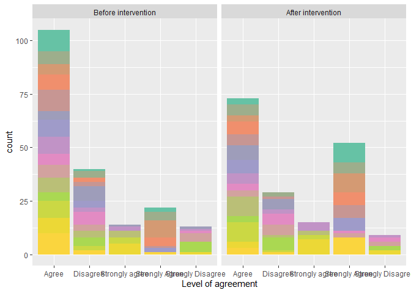
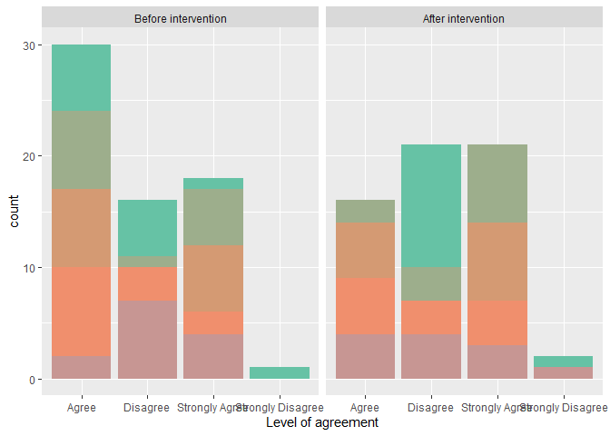
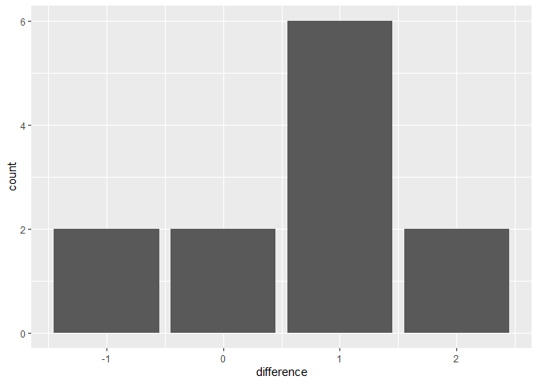

Rock climbing survey data claning & analysis
================
Sunny Tseng
2023-03-05

### Data description

There are 3 cohorts experienced rock climbing intervention. Surveys were
done before intervention, after intervention, and 1-year after
intervention (only for cohort 1). This research is aim to understand how
the intervention would influence the behaviour of the participants.
There were 20 questions asked, with 4 different levels: Strongly Agree,
Agree, Disagree, Strongly Disagree. The goal of the analysis is to test
whether there are significant differences between those levels before
and after the intervention.

### R packages

Here we install (by `install.packages()`) and load (by `library()`) the
packages that we will need. A package is like a tool box in R, that
includes many functions. For example, `tidyverse` package provides
functions for data wrangling and data cleaning, `here` packages provides
functions for working directory management.

``` r
library(tidyverse)
library(readxl)
library(here)
library(RColorBrewer)
library(coin)
```

## Cohort 1

### Import data

Use `read_excel` to import raw data. Note that the name of the folder
and the file name were changed as there were parentheses `()` and commas
`,` in the original name, which causes error when importing files into
R.

``` r
data_c1_s1 <- read_excel(here("data", 
                              "Cohort 1 Surveys_123_spreadsheets", 
                              "VIMFF Cohort 1 Survey 1_pre-intervention.xlsx"))

data_c1_s2 <- read_excel(here("data", 
                              "Cohort 1 Surveys_123_spreadsheets", 
                              "VIMFF Cohort 1 Survey 2_post-intervention.xlsx"))

data_c1_s3 <- read_excel(here("data", 
                              "Cohort 1 Surveys_123_spreadsheets", 
                              "VIMFF Cohort 1 Survey 3_post-post.xlsx"))
```

### Data cleaning

Cleaned column names, combined columns with multiple choice answers,
changed the categorical answer into 1 - 4 for easier analysis. Only
select columns that will need in the following analysis.

For cohort 1, survey 1:

``` r
new_name <- function(dataset, start, end){
  dataset[1, start:end] %>% as_vector()
}

data_c1_s1_clean <- data_c1_s1 %>%
  rename_with(.fn =~ new_name(data_c1_s1, 65, 84), .cols = c(65:84)) %>%
  filter(row_number() != 1) %>%
  unite(gender, names(.)[11:23], sep = ",", na.rm = TRUE) %>%
  unite(nationality, names(.)[12:28], sep = ",", na.rm = TRUE) %>%
  unite(indoor_style_practice, names(.)[24:26], sep = ",", na.rm = TRUE) %>%
  unite(outdoor_style_practice, names(.)[29:34], sep = ",", na.rm = TRUE) %>%
  mutate(cohort = "c1", survey = "s1") 

data_c1_s1_clean_1 <- data_c1_s1_clean %>%
  select("Respondent ID", "Collector ID", "indoor_style_practice",
         "outdoor_style_practice", 30:49, "cohort", "survey") 

#data_c1_s1_clean %>% str()
```

For cohort 1, survey 2:

``` r
data_c1_s2_clean <- data_c1_s2 %>%
  rename_with(.fn =~ new_name(data_c1_s2, 32, 51), .cols = c(32:51)) %>%
  filter(row_number() != 1) %>%
  unite(indoor_style_practice, names(.)[19:21], sep = ",", na.rm = TRUE) %>%
  unite(outdoor_style_practice, names(.)[24:29], sep = ",", na.rm = TRUE) %>%
  mutate(cohort = "c1", survey = "s2") %>%
  select("Respondent ID", "Collector ID", "indoor_style_practice",
         "outdoor_style_practice", 25:44, "cohort", "survey") 

#data_c1_s2_clean %>% str()
```

For cohort 1, survey 3:

``` r
data_c1_s3_clean <- data_c1_s3 %>%
  rename_with(.fn =~ new_name(data_c1_s3, 32, 51), .cols = c(32:51)) %>%
  filter(row_number() != 1) %>%
  unite(indoor_style_practice, names(.)[19:21], sep = ",", na.rm = TRUE) %>%
  unite(outdoor_style_practice, names(.)[24:29], sep = ",", na.rm = TRUE) %>%
  mutate(cohort = "c1", survey = "s3") %>%
  select("Respondent ID", "Collector ID", "indoor_style_practice",
         "outdoor_style_practice", 25:44, "cohort", "survey") 

#data_c1_s3_clean %>% str()
```

For cohort 1 (final summary). Note that there are some mismatch between
column names. Need to fix that before combining data frames. Here we
only use before & after interventation for demonstration. We also
compiled a dataframe to show individual participant information.

``` r
# s1 says "I find it difficult to find transportation to go outdoor climbing", while
# s2 says "I find it difficult to find transportation to outdoor climbing"
# There are many mis-match between s3 and s1&s2. Need check!

names(data_c1_s1_clean_1)[23] <- names(data_c1_s2_clean)[23] 
data_c1_clean <- bind_rows(data_c1_s1_clean_1, data_c1_s2_clean) %>%
    mutate_at(c(5:24), ~recode(., "Strongly Agree" = 4,
                             "Strongly agree" = 4,
                             "Agree" = 3,
                             "Disagree" = 2,
                             "Strongly Disagree" = 1,
                             "Strongly disagree" = 1),
            na.rm = TRUE) %>%
    mutate_at(c(5:24), ~recode(., "4" = "Strongly Agree",
                               "3" = "Agree",
                               "2" = "Disagree",
                               "1" = "Strongly Disagree")) %>%
    mutate_at(c(5:24), ~ factor(., levels = c("Strongly Disagree",
                                              "Disagree",
                                              "Agree",
                                              "Strongly Agree"))) 


data_c1_clean %>% str()
```

    ## tibble [25 x 26] (S3: tbl_df/tbl/data.frame)
    ##  $ Respondent ID                                                                                      : chr [1:25] "Participant 1" "Participant 2" "Participant 3" "Participant 4" ...
    ##  $ Collector ID                                                                                       : num [1:25] 2.7e+08 2.7e+08 2.7e+08 2.7e+08 2.7e+08 ...
    ##  $ indoor_style_practice                                                                              : chr [1:25] "Bouldering" "Bouldering" "Bouldering" "Bouldering" ...
    ##  $ outdoor_style_practice                                                                             : chr [1:25] "Bouldering" "" "" "" ...
    ##  $ I love to climb                                                                                    : Factor w/ 4 levels "Strongly Disagree",..: 3 3 2 3 3 2 3 3 3 4 ...
    ##  $ Climbing is fun                                                                                    : Factor w/ 4 levels "Strongly Disagree",..: 3 3 3 3 4 2 3 3 3 4 ...
    ##  $ I am motivated to climb                                                                            : Factor w/ 4 levels "Strongly Disagree",..: 3 3 3 3 3 3 2 3 2 4 ...
    ##  $ I feel encouraged in my climbing                                                                   : Factor w/ 4 levels "Strongly Disagree",..: 3 3 2 3 4 2 3 3 3 4 ...
    ##  $ I feel hindered in my climbing                                                                     : Factor w/ 4 levels "Strongly Disagree",..: 1 2 3 2 2 4 2 3 2 3 ...
    ##  $ I am inspired to climb by my female-identified climbing friends                                    : Factor w/ 4 levels "Strongly Disagree",..: 4 3 4 4 4 3 3 3 4 4 ...
    ##  $ I am inspired to climb by films showcasing outdoor women climbers                                  : Factor w/ 4 levels "Strongly Disagree",..: 3 3 3 4 4 2 4 2 4 3 ...
    ##  $ I am inspired to spend more time outdoors after watching films that showcase outdoor women climbers: Factor w/ 4 levels "Strongly Disagree",..: 3 3 3 4 4 3 4 2 4 3 ...
    ##  $ I feel represented within the climbing community                                                   : Factor w/ 4 levels "Strongly Disagree",..: 3 3 2 1 3 1 3 2 2 3 ...
    ##  $ I feel outdoor climbing guides are representative of the larger Vancouver and Squamish area        : Factor w/ 4 levels "Strongly Disagree",..: 3 2 NA 1 3 2 3 2 3 3 ...
    ##  $ I feel welcomed in the climbing community                                                          : Factor w/ 4 levels "Strongly Disagree",..: 3 3 3 3 4 2 3 3 3 4 ...
    ##  $ I feel safe in the climbing community                                                              : Factor w/ 4 levels "Strongly Disagree",..: 3 3 2 3 4 2 3 2 3 4 ...
    ##  $ I feel connected to the climbing community                                                         : Factor w/ 4 levels "Strongly Disagree",..: 3 3 2 2 3 2 3 2 2 4 ...
    ##  $ I feel the climbing community reflects the diversity of Vancouver and Squamish areas               : Factor w/ 4 levels "Strongly Disagree",..: 3 3 2 1 3 1 3 2 2 1 ...
    ##  $ I feel it is possible for anyone to progress in climbing                                           : Factor w/ 4 levels "Strongly Disagree",..: 3 3 2 1 4 2 3 4 3 3 ...
    ##  $ I find indoor climbing more accessible than outdoor climbing                                       : Factor w/ 4 levels "Strongly Disagree",..: 3 3 4 1 3 3 4 3 4 3 ...
    ##  $ I find it difficult to find the resources to go outdoor climbing                                   : Factor w/ 4 levels "Strongly Disagree",..: 3 3 3 4 3 4 4 3 4 4 ...
    ##  $ I find it difficult to find the time to go outdoor climbing                                        : Factor w/ 4 levels "Strongly Disagree",..: 3 2 2 2 4 4 3 3 3 3 ...
    ##  $ I find it difficult to find transportation to outdoor climbing                                     : Factor w/ 4 levels "Strongly Disagree",..: 3 2 4 4 2 4 2 3 2 4 ...
    ##  $ I find it difficult to find friends to go outdoor climbing with                                    : Factor w/ 4 levels "Strongly Disagree",..: 3 3 3 4 3 4 4 3 4 3 ...
    ##  $ cohort                                                                                             : chr [1:25] "c1" "c1" "c1" "c1" ...
    ##  $ survey                                                                                             : chr [1:25] "s1" "s1" "s1" "s1" ...

``` r
data_c1_clean_individual <- data_c1_s1_clean %>%
  select("Respondent ID", "gender", "nationality", 13:18)

data_c1_clean_individual %>% str()
```

    ## tibble [13 x 9] (S3: tbl_df/tbl/data.frame)
    ##  $ Respondent ID                                                             : chr [1:13] "Participant 1" "Participant 2" "Participant 3" "Participant 4" ...
    ##  $ gender                                                                    : chr [1:13] "Girl/Woman" "Girl/Woman" "Girl/Woman" "Girl/Woman" ...
    ##  $ nationality                                                               : chr [1:13] "Black (e.g., African or Caribbean)" "Filipino" "South Asian (e.g., Indian, Pakistani, Sri Lankan)" "Black (e.g., African or Caribbean),Arab" ...
    ##  $ What is your annual household income?                                     : chr [1:13] "$25,000 to $50,000" "$50,000 to $100,000" "Prefer not to answer" "$50,000 to $100,000" ...
    ##  $ What is the highest level of education you have completed?                : chr [1:13] "Bachelor's degree" "Master's degree" "Bachelor's degree" "Master's degree" ...
    ##  $ What is your age?                                                         : chr [1:13] "24" "50" "30" "34" ...
    ##  $ What is your employment?                                                  : chr [1:13] "Employment Counsellor" "Bank" "Legal Counsel" "Healthcare worker." ...
    ##  $ Is there any other identifying information that you would like to provide?: chr [1:13] "NA" "Single mom" NA "I wear a hijab." ...
    ##  $ How do you consider yourself as a climber in terms of skills/expertise?   : chr [1:13] "Beginner" "Beginner" "Beginner" "Beginner" ...

## Cohort 2

### Import data

``` r
data_c2_s1 <- read_excel(here("data", 
                              "Cohort 2 Surveys_12_Spreadsheets", 
                              "VIMFF Cohort 2 Survey 1_pre.xlsx"))

data_c2_s2 <- read_excel(here("data", 
                              "Cohort 2 Surveys_12_Spreadsheets", 
                              "VIMFF Cohort 2 Survey 2_post.xlsx"))
```

### Data cleaning

For cohort 2, survey 1:

``` r
new_name <- function(dataset, start, end){
  dataset[1, start:end] %>% as_vector()
}

data_c2_s1_clean <- data_c2_s1 %>%
  rename_with(.fn =~ new_name(data_c2_s1, 66, 85), .cols = c(66:85)) %>%
  filter(row_number() != 1) %>%
  unite(gender, names(.)[11:24], sep = ",", na.rm = TRUE) %>%
  unite(nationality, names(.)[12:28], sep = ",", na.rm = TRUE) %>%
  unite(indoor_style_practice, names(.)[24:26], sep = ",", na.rm = TRUE) %>%
  unite(outdoor_style_practice, names(.)[29:34], sep = ",", na.rm = TRUE) %>%
  mutate(cohort = "c2", survey = "s1") %>%
  select("Respondent ID", "Collector ID", "indoor_style_practice",
         "outdoor_style_practice", 30:49, "cohort", "survey") 
```

For cohort 2, survey 2:

``` r
data_c2_s2_clean <- data_c2_s2 %>%
  rename_with(.fn =~ new_name(data_c2_s2, 32, 51), .cols = c(32:51)) %>%
  filter(row_number() != 1) %>%
  unite(indoor_style_practice, names(.)[19:21], sep = ",", na.rm = TRUE) %>%
  unite(outdoor_style_practice, names(.)[24:29], sep = ",", na.rm = TRUE) %>%
  mutate(cohort = "c2", survey = "s2") %>%
  select("Respondent ID", "Collector ID", "indoor_style_practice",
         "outdoor_style_practice", 25:44, "cohort", "survey") 
```

For cohort 2, final summary:

``` r
# s1 says "I find it difficult to find transportation to go outdoor climbing", while
# s2 says "I find it difficult to find transportation to outdoor climbing"

names(data_c2_s1_clean)[23] <- names(data_c2_s2_clean)[23] 
data_c2_clean <- bind_rows(data_c2_s1_clean, data_c2_s2_clean) %>%
    mutate_at(c(5:24), ~recode(., "Strongly Agree" = 4,
                             "Strongly agree" = 4,
                             "Agree" = 3,
                             "Disagree" = 2,
                             "Strongly Disagree" = 1,
                             "Strongly disagree" = 1),
            na.rm = TRUE) %>%
    mutate_at(c(5:24), ~recode(., "4" = "Strongly Agree",
                               "3" = "Agree",
                               "2" = "Disagree",
                               "1" = "Strongly Disagree")) %>%
    mutate_at(c(5:24), ~ factor(., levels = c("Strongly Disagree",
                                              "Disagree",
                                              "Agree",
                                              "Strongly Agree"))) 

data_c2_clean %>% str()
```

    ## tibble [24 x 26] (S3: tbl_df/tbl/data.frame)
    ##  $ Respondent ID                                                                                      : chr [1:24] "Participant 14" "Participant 15" "Participant 16" "Participant 17" ...
    ##  $ Collector ID                                                                                       : num [1:24] 2.7e+08 2.7e+08 2.7e+08 2.7e+08 2.7e+08 ...
    ##  $ indoor_style_practice                                                                              : chr [1:24] "" "Bouldering" "Bouldering,Top-rope" "" ...
    ##  $ outdoor_style_practice                                                                             : chr [1:24] "" "" "Bouldering" "" ...
    ##  $ I love to climb                                                                                    : Factor w/ 4 levels "Strongly Disagree",..: 4 2 4 3 3 3 2 3 3 3 ...
    ##  $ Climbing is fun                                                                                    : Factor w/ 4 levels "Strongly Disagree",..: 4 3 4 3 4 3 2 3 3 4 ...
    ##  $ I am motivated to climb                                                                            : Factor w/ 4 levels "Strongly Disagree",..: 4 3 4 3 2 3 3 3 3 4 ...
    ##  $ I feel encouraged in my climbing                                                                   : Factor w/ 4 levels "Strongly Disagree",..: 4 3 4 4 2 4 2 2 3 4 ...
    ##  $ I feel hindered in my climbing                                                                     : Factor w/ 4 levels "Strongly Disagree",..: 2 3 2 2 4 2 3 3 3 3 ...
    ##  $ I am inspired to climb by my female-identified climbing friends                                    : Factor w/ 4 levels "Strongly Disagree",..: 4 4 4 4 2 4 3 4 2 3 ...
    ##  $ I am inspired to climb by films showcasing outdoor women climbers                                  : Factor w/ 4 levels "Strongly Disagree",..: 3 4 3 3 3 4 3 3 3 1 ...
    ##  $ I am inspired to spend more time outdoors after watching films that showcase outdoor women climbers: Factor w/ 4 levels "Strongly Disagree",..: 3 3 4 3 3 4 3 3 2 3 ...
    ##  $ I feel represented within the climbing community                                                   : Factor w/ 4 levels "Strongly Disagree",..: 2 3 2 2 1 3 1 2 3 1 ...
    ##  $ I feel outdoor climbing guides are representative of the larger Vancouver and Squamish area        : Factor w/ 4 levels "Strongly Disagree",..: 2 2 2 2 2 2 1 2 NA 3 ...
    ##  $ I feel welcomed in the climbing community                                                          : Factor w/ 4 levels "Strongly Disagree",..: 3 3 4 3 3 3 2 3 2 3 ...
    ##  $ I feel safe in the climbing community                                                              : Factor w/ 4 levels "Strongly Disagree",..: 3 3 4 3 3 3 2 3 2 3 ...
    ##  $ I feel connected to the climbing community                                                         : Factor w/ 4 levels "Strongly Disagree",..: 2 2 4 2 2 2 2 2 2 2 ...
    ##  $ I feel the climbing community reflects the diversity of Vancouver and Squamish areas               : Factor w/ 4 levels "Strongly Disagree",..: 1 2 2 2 2 2 1 3 2 3 ...
    ##  $ I feel it is possible for anyone to progress in climbing                                           : Factor w/ 4 levels "Strongly Disagree",..: 4 4 4 3 3 3 2 3 2 3 ...
    ##  $ I find indoor climbing more accessible than outdoor climbing                                       : Factor w/ 4 levels "Strongly Disagree",..: 3 4 4 4 3 4 3 4 4 3 ...
    ##  $ I find it difficult to find the resources to go outdoor climbing                                   : Factor w/ 4 levels "Strongly Disagree",..: 4 3 4 2 4 3 3 4 4 3 ...
    ##  $ I find it difficult to find the time to go outdoor climbing                                        : Factor w/ 4 levels "Strongly Disagree",..: 3 2 4 3 2 3 4 3 4 2 ...
    ##  $ I find it difficult to find transportation to outdoor climbing                                     : Factor w/ 4 levels "Strongly Disagree",..: 4 2 4 3 4 2 4 4 2 2 ...
    ##  $ I find it difficult to find friends to go outdoor climbing with                                    : Factor w/ 4 levels "Strongly Disagree",..: 3 2 4 3 4 3 4 4 4 3 ...
    ##  $ cohort                                                                                             : chr [1:24] "c2" "c2" "c2" "c2" ...
    ##  $ survey                                                                                             : chr [1:24] "s1" "s1" "s1" "s1" ...

## Cohort 3

### Import data

``` r
data_c3_s1 <- read_excel(here("data", 
                              "Cohort 3 Surveys_12_spreadsheets", 
                              "VIMFF Cohort 3 Survey 1_pre.xlsx"))

data_c3_s2 <- read_excel(here("data", 
                              "Cohort 3 Surveys_12_spreadsheets", 
                              "VIMFF Cohort 3 Survey 2_post.xlsx"))
```

### Data cleaning

For cohort 3, survey 1:

``` r
new_name <- function(dataset, start, end){
  dataset[1, start:end] %>% as_vector()
}

data_c3_s1_clean <- data_c3_s1 %>%
  rename_with(.fn =~ new_name(data_c3_s1, 67, 99), .cols = c(67:99)) %>%
  rename_with(.fn =~ new_name(data_c3_s1, 105, 119), .cols = c(105:119)) %>%
  filter(row_number() != 1) %>%
  unite(gender, names(.)[11:24], sep = ",", na.rm = TRUE) %>%
  unite(nationality, names(.)[12:28], sep = ",", na.rm = TRUE) %>%
  unite(indoor_style_practice, names(.)[24:26], sep = ",", na.rm = TRUE) %>%
  unite(outdoor_style_practice, names(.)[29:34], sep = ",", na.rm = TRUE) %>%
  mutate(cohort = "c3", survey = "s1") %>%
  select("Respondent ID", "Collector ID", "indoor_style_practice",
         "outdoor_style_practice", 31:63, 69:83, "cohort", "survey") 
```

For cohort 3, survey 2:

``` r
data_c3_s2_clean <- data_c3_s2 %>%
  rename_with(.fn =~ new_name(data_c3_s2, 34, 66), .cols = c(34:66)) %>%
  rename_with(.fn =~ new_name(data_c3_s2, 74, 85), .cols = c(74:85)) %>%
  filter(row_number() != 1) %>%
  unite(indoor_style_practice, names(.)[19:21], sep = ",", na.rm = TRUE) %>%
  unite(outdoor_style_practice, names(.)[24:29], sep = ",", na.rm = TRUE) %>%
  mutate(cohort = "c3", survey = "s2") %>%
  select("Respondent ID", "Collector ID", "indoor_style_practice",
         "outdoor_style_practice", 27:59, 67:78, "cohort", "survey") 
```

For cohort 3, final summary: **Too many mismatch between two surveys.
Can’t fully determine which ones are matched. Only keep the columns with
identical names.**

``` r
data_c3_clean <- bind_rows(data_c3_s1_clean, data_c3_s2_clean) %>%
  select(where(function(x) is.na(x) %>% sum() < 10))
data_c3_clean %>% str()
```

    ## tibble [20 x 43] (S3: tbl_df/tbl/data.frame)
    ##  $ Respondent ID                                                                                      : chr [1:20] "Participant 26" "Participant 27" "Participant 28" "Participant 29" ...
    ##  $ Collector ID                                                                                       : num [1:20] 2.7e+08 2.7e+08 2.7e+08 2.7e+08 2.7e+08 ...
    ##  $ indoor_style_practice                                                                              : chr [1:20] "Bouldering,Top-rope,Lead" "Bouldering" "" "" ...
    ##  $ outdoor_style_practice                                                                             : chr [1:20] "Top-rope,Lead" "" "" "" ...
    ##  $ I love to climb                                                                                    : chr [1:20] "Agree" "Strongly Agree" "Disagree" "Disagree" ...
    ##  $ Climbing is fun                                                                                    : chr [1:20] "Agree" "Strongly Agree" "Agree" "Disagree" ...
    ##  $ I am motivated to climb                                                                            : chr [1:20] "Agree" "Agree" "Agree" "Agree" ...
    ##  $ I feel encouraged in my climbing                                                                   : chr [1:20] "Agree" "Agree" "Disagree" "Disagree" ...
    ##  $ I feel hindered in my climbing                                                                     : chr [1:20] "Agree" "Disagree" "Disagree" "Agree" ...
    ##  $ I am inspired to climb by my female-identified climbing friends                                    : chr [1:20] "Agree" "Strongly Agree" "Agree" "Agree" ...
    ##  $ I am inspired to climb by films showcasing outdoor womxn climbers                                  : chr [1:20] "Agree" "Agree" "Agree" "Agree" ...
    ##  $ I am inspired to spend more time outdoors after watching films that showcase outdoor womxn climbers: chr [1:20] "Agree" "Agree" "Strongly Agree" "Agree" ...
    ##  $ I am inspired to go outdoor climbing after watching films that showcase outdoor womxn climbers     : chr [1:20] "Agree" "Agree" "Strongly Agree" "Disagree" ...
    ##  $ I feel represented within the climbing community                                                   : chr [1:20] "Disagree" "Disagree" "Agree" "Strongly Disagree" ...
    ##  $ I feel outdoor climbing guides are representative of the larger Vancouver and Squamish area        : chr [1:20] "Agree" "Agree" "Disagree" "Disagree" ...
    ##  $ I feel welcomed in the climbing community                                                          : chr [1:20] "Agree" "Agree" "Agree" "Agree" ...
    ##  $ I feel safe in the climbing community                                                              : chr [1:20] "Agree" "Agree" "Agree" "Agree" ...
    ##  $ I feel connected to the climbing community                                                         : chr [1:20] "Disagree" "Disagree" "Disagree" "Disagree" ...
    ##  $ I feel the climbing community reflects the diversity of Vancouver and Squamish areas               : chr [1:20] "Agree" "Disagree" "Strongly Disagree" "Strongly Disagree" ...
    ##  $ I feel it is possible for anyone to progress in climbing                                           : chr [1:20] "Agree" "Agree" "Agree" "Strongly agree" ...
    ##  $ I find indoor climbing more accessible than outdoor climbing                                       : chr [1:20] "Disagree" "Strongly agree" "Strongly agree" "Strongly agree" ...
    ##  $ I find it difficult to find the resources to go outdoor climbing                                   : chr [1:20] "Disagree" "Agree" "Strongly Agree" "Strongly Agree" ...
    ##  $ I find it difficult to find the time to go outdoor climbing                                        : chr [1:20] "Disagree" "Strongly Agree" "Agree" "Strongly Agree" ...
    ##  $ I find it difficult to find friends to go outdoor climbing with                                    : chr [1:20] "Agree" "Strongly Agree" "Agree" "Strongly Agree" ...
    ##  $ Go top-rope climbing outdoors                                                                      : chr [1:20] "Somewhat likely" "Not likely" "Not likely" "Not likely" ...
    ##  $ Go bouldering outdoors                                                                             : chr [1:20] "Not likely" "Somewhat likely" "Not likely" "Not likely" ...
    ##  $ Purchase an indoor climbing gym membership                                                         : chr [1:20] "Not likely" "Very likely" "Somewhat likely" "Not likely" ...
    ##  $ Purchase climbing shoes                                                                            : chr [1:20] "Very likely" "Very likely" "Somewhat likely" "Not likely" ...
    ##  $ Go top-rope climbing indoors                                                                       : chr [1:20] "Very likely" "Somewhat likely" "Somewhat likely" "Not likely" ...
    ##  $ Go bouldering indoors                                                                              : chr [1:20] "Somewhat likely" "Very likely" "Somewhat likely" "Not likely" ...
    ##  $ Top-rope climbing outdoors                                                                         : chr [1:20] "Of Average Importance" "Not Important At All" "Not Important At All" "Not Important At All" ...
    ##  $ Bouldering outdoors                                                                                : chr [1:20] "Of Little Importance" "Not Important At All" "Not Important At All" "Not Important At All" ...
    ##  $ Having an indoor gym membership                                                                    : chr [1:20] "Of Little Importance" "Very Important" "Not Important At All" "Not Important At All" ...
    ##  $ Owning my own climbing shoes                                                                       : chr [1:20] "Absolutely Essential" "Very Important" "Not Important At All" "Not Important At All" ...
    ##  $ Top-rope climbing indoors                                                                          : chr [1:20] "Of Average Importance" "Not Important At All" "Not Important At All" "Not Important At All" ...
    ##  $ Bouldering indoors                                                                                 : chr [1:20] "Of Average Importance" "Very Important" "Not Important At All" "Not Important At All" ...
    ##  $ Making friends from the program to go climbing with in the future                                  : chr [1:20] "Of Average Importance" "Of Average Importance" "Very Important" "Very Important" ...
    ##  $ Watching VIMFF films that feature Black, Indigenous, or other racialized womxn in the outdoors     : chr [1:20] "Of Average Importance" "Of Average Importance" "Very Important" "Of Little Importance" ...
    ##  $ Watching VIMFF films in community with other climbers from the program                             : chr [1:20] "Of Average Importance" "Of Average Importance" "Of Average Importance" "Of Average Importance" ...
    ##  $ Learning climbing skills from certified instructors                                                : chr [1:20] "Absolutely Essential" "Absolutely Essential" "Very Important" "Absolutely Essential" ...
    ##  $ Learning climbing skills in a safe, welcoming environment                                          : chr [1:20] "Absolutely Essential" "Absolutely Essential" "Very Important" "Absolutely Essential" ...
    ##  $ cohort                                                                                             : chr [1:20] "c3" "c3" "c3" "c3" ...
    ##  $ survey                                                                                             : chr [1:20] "s1" "s1" "s1" "s1" ...

### Data visualization

Positive questions for climbing - before & after intervention

``` r
nb.cols <- 20
mycolors <- colorRampPalette(brewer.pal(8, "Set2"))(nb.cols)

positive_c1_fig <- data_c1_clean %>%
  filter(cohort == "c1") %>%
  select(`Respondent ID`, survey, 5:8, 10:20) %>%
  pivot_longer(!c(`Respondent ID`, survey), 
               names_to = "question", 
               values_to = "Level of agreement") %>%
  mutate(survey = if_else(survey == "s1", "Before intervention", "After intervention")) %>%
  mutate(survey = factor(survey, levels = c("Before intervention", "After intervention"))) %>%
  drop_na() %>%
  ggplot() +
    geom_bar(aes(`Level of agreement`, fill = question)) + # position = position_dodge()
    scale_fill_manual(values = mycolors) +
    facet_grid(~survey) +
    theme(legend.position = "none") 

positive_c1_fig
```

<!-- -->

``` r
positive_c1_table <- data_c1_clean %>%
  filter(cohort == "c1") %>%
  select(`Respondent ID`, survey, 5:8, 10:20) %>%
  pivot_longer(!c(`Respondent ID`, survey), 
               names_to = "question", 
               values_to = "agreement") %>%
  drop_na() %>%
  group_by(agreement, survey) %>%
  summarize(n = n()) %>%
  pivot_wider(names_from = survey, values_from = n) %>%
  mutate(percent_before = s1/sum(.$s1)*100,
         percent_after = s2/sum(.$s2)*100) %>%
  rename(n_before = "s1", n_after = "s2") %>%
  select(agreement, n_before, percent_before, n_after, percent_after)
```

    ## `summarise()` has grouped output by 'agreement'. You can override using the
    ## `.groups` argument.

``` r
positive_c1_table
```

    ## # A tibble: 4 x 5
    ## # Groups:   agreement [4]
    ##   agreement         n_before percent_before n_after percent_after
    ##   <fct>                <int>          <dbl>   <int>         <dbl>
    ## 1 Strongly Disagree       13           6.70       9          5.06
    ## 2 Disagree                40          20.6       29         16.3 
    ## 3 Agree                  105          54.1       73         41.0 
    ## 4 Strongly Agree          36          18.6       67         37.6

Negative questions for climbing - before & after intervention

``` r
nb.cols <- 20
mycolors <- colorRampPalette(brewer.pal(8, "Set2"))(nb.cols)

negative_c1 <- data_c1_clean %>%
  filter(cohort == "c1") %>%
  select(`Respondent ID`, survey, 9, 21:24) %>%
  pivot_longer(!c(`Respondent ID`, survey), 
               names_to = "question", 
               values_to = "Level of agreement") %>%
  mutate(survey = if_else(survey == "s1", "Before intervention", "After intervention")) %>%
  mutate(survey = factor(survey, levels = c("Before intervention", "After intervention"))) %>%
  drop_na() %>%
  ggplot() +
    geom_bar(aes(`Level of agreement`, fill = question)) + # position = position_dodge()
    scale_fill_manual(values = mycolors) +
    facet_grid(~survey) +
    theme(legend.position = "none") 

negative_c1
```

<!-- -->

``` r
negative_c1_table <- data_c1_clean %>%
  filter(cohort == "c1") %>%
  select(`Respondent ID`, survey, 9, 21:24) %>%
  pivot_longer(!c(`Respondent ID`, survey), 
               names_to = "question", 
               values_to = "agreement") %>%
  drop_na() %>%
  group_by(agreement, survey) %>%
  summarize(n = n()) %>%
  pivot_wider(names_from = survey, values_from = n) %>%
  mutate(percent_before = s1/sum(.$s1)*100,
         percent_after = s2/sum(.$s2)*100) %>%
  rename(n_before = "s1", n_after = "s2") %>%
  select(agreement, n_before, percent_before, n_after, percent_after)
```

    ## `summarise()` has grouped output by 'agreement'. You can override using the
    ## `.groups` argument.

``` r
negative_c1_table
```

    ## # A tibble: 4 x 5
    ## # Groups:   agreement [4]
    ##   agreement         n_before percent_before n_after percent_after
    ##   <fct>                <int>          <dbl>   <int>         <dbl>
    ## 1 Strongly Disagree        1           1.54       2          3.33
    ## 2 Disagree                16          24.6       21         35   
    ## 3 Agree                   30          46.2       16         26.7 
    ## 4 Strongly Agree          18          27.7       21         35

### Statistical test for paired ordinal data

#### Some good online resources:

-   [What types of statistical test can be used for paired categorical
    variables](https://www.researchgate.net/post/What-types-of-statistical-test-can-be-used-for-paired-categorical-variables-For-more-than-two-category)

-   [What is the most suitable statistical test for ordinal
    data](https://www.researchgate.net/post/What_is_the_most_suitable_statistical_test_for_ordinal_data_eg_Likert_scales#:~:text=The%20most%20suitable%20statistical%20tests,%2C%20no%20assumption%20on%20distribution)

-   [Choosing the Right Statistical
    Test](https://www.scribbr.com/statistics/statistical-tests/#:~:text=They%20can%20be%20used%20to%20test%20the%20effect%20of%20a,heights%20of%20men%20and%20women)

-   [Can You Use a T-Test on Ranked
    Data?](https://sciencing.com/can-use-ttest-ranked-data-12010046.html)

#### T-test

> T-tests are not appropriate to use with ordinal data. Because ordinal
> data has no central tendency, it also has no normal distribution. The
> values of ordinal data are evenly distributed, not grouped around a
> mid-point. Because of this, a t-test of ordinal data would have no
> statistical meaning.

#### Wilcoxon Signed Rank Test

> The Wilcoxon signed rank test (also called the Wilcoxon signed rank
> sum test) is a non-parametric test to compare data. The Wilcoxon
> signed rank test should be used if the differences between pairs of
> data are non-normally distributed. The Wilcoxon matched-pairs signed
> rank test computes the difference between each set of matched pairs,
> then follows the same procedure as the signed rank test to compare the
> sample against some median. The null hypothesis for this test is that
> the medians of two samples are equal.

### Wilcoxon matched-pairs signed rank test for single question

The following analysis is based on the instructions provided by [Ordinal
vs Ordinal
paired](https://peterstatistics.com/CrashCourse/4-TwoVarPair/OrdOrd/OrdOrdPair0.html).
Here we demonstrate a single question, say the 5th column.

First we summarize the response of the participants:

``` r
wilcox_1 <- data_c1_clean %>%
  select(`Respondent ID`, 5, `survey`) %>%
  mutate_at(c(2), ~recode(., "Strongly Agree" = 4,
                             "Agree" = 3,
                             "Disagree" = 2,
                             "Strongly Disagree" = 1)) %>%
  pivot_wider(names_from = survey, values_from = `I love to climb`) 

wilcox_1
```

    ## # A tibble: 13 x 3
    ##    `Respondent ID`    s1    s2
    ##    <chr>           <dbl> <dbl>
    ##  1 Participant 1       3     4
    ##  2 Participant 2       3     2
    ##  3 Participant 3       2     4
    ##  4 Participant 4       3     3
    ##  5 Participant 5       3     4
    ##  6 Participant 6       2     4
    ##  7 Participant 7       3     4
    ##  8 Participant 8       3     3
    ##  9 Participant 9       3     4
    ## 10 Participant 10      4     3
    ## 11 Participant 11      3     4
    ## 12 Participant 12      3     4
    ## 13 Participant 13      3    NA

Then we plot out the bar plot of difference to see the trend of change
between before and after.

``` r
wilcox_1_box <- wilcox_1 %>%
  mutate(difference = s2 - s1) %>%
  ggplot() +
    geom_bar(aes(difference))

wilcox_1_box
```

<!-- -->

Finally we conduct a statistical test and look for p-value, with the
null hypothesis being **the medians of two samples are equal**.

``` r
wilcox.test(x = wilcox_1$s1, y = wilcox_1$s2,
            paired = TRUE,
            conf.int = TRUE,
            conf.level = 0.95)
```

    ## 
    ##  Wilcoxon signed rank test with continuity correction
    ## 
    ## data:  wilcox_1$s1 and wilcox_1$s2
    ## V = 9, p-value = 0.05175
    ## alternative hypothesis: true location shift is not equal to 0
    ## 95 percent confidence interval:
    ##  -1.500012e+00  3.290173e-05
    ## sample estimates:
    ## (pseudo)median 
    ##     -0.9999941

``` r
wilcoxsign_test(wilcox_1$s1 ~ wilcox_1$s2, zero.method = "Wilcoxon")
```

    ## 
    ##  Asymptotic Wilcoxon Signed-Rank Test
    ## 
    ## data:  y by x (pos, neg) 
    ##   stratified by block
    ## Z = -1.9993, p-value = 0.04558
    ## alternative hypothesis: true mu is not equal to 0

### Questions for the dataset :)

-   Are the data of the 3 cohorts need to be pooled? Or each of the
    cohort need to be compared seperately?
-   There are some NAs in the reply?
-   Pool the questions, or by group (positive & negative), or by single
    question?
