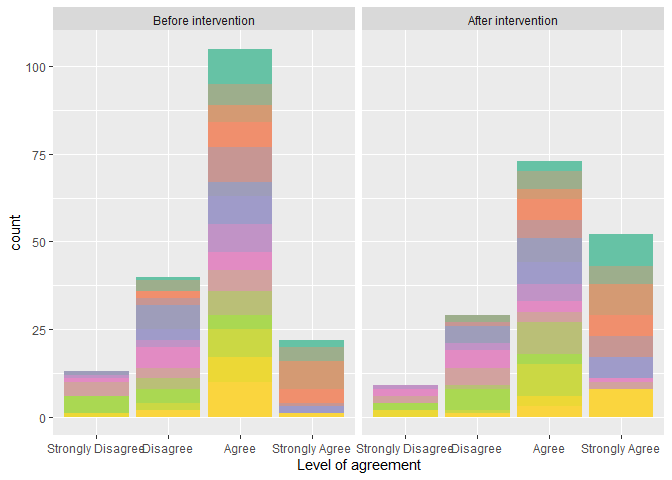
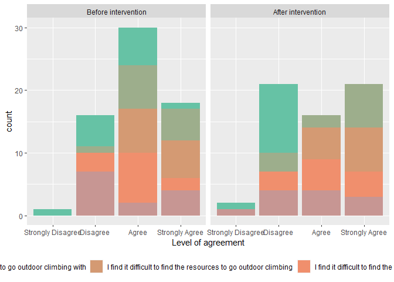

Rock climbing survey data claning & t-test
================
Sunny Tseng
2023-03-05

### Data description

There are 3 cohorts experienced rock climbing intervention. Surveys were
done before intervention, after intervention, and 1-year after
intervention (only for cohort 1). This research is aim to understand how
the intervention would influence the behaviour of the participants.
Cohort 1 includes 12 people, cohort 2 include

And there were 20 questions asked, with 4 different levels: Strongly
Agree, Agree, Disagree, Strongly Disagree. The goal of the analysi is to
test whether there are differences between those levels before and after
the intervention.

### R packages & other functions

Here we install (by `install.packages()`) and load (by `library()`) the
packages that we will need. A package is like a tool box in R, that
includes many functions. For example, `tidyverse` package provides
functions for data wrangling and data cleaning, `here` packages provides
functions for working directory management.

``` r
#install.packages("tidyverse")
#install.packages("here")
library(tidyverse)
library(readxl)
library(here)
library(knitr)
library(RColorBrewer)
```

## Cohort 1

### Import data

Use `read_excel` to import raw data. Note that the name of the folder
and the file name were changed as there were parentheses `()` and commas
`,` in the original name, which causes error when importing files into
R.

``` r
data_c1_s1 <- read_excel(here("data", 
                              "Cohort 1 Surveys_123_spreadsheets", 
                              "VIMFF Cohort 1 Survey 1_pre-intervention.xlsx"))

data_c1_s2 <- read_excel(here("data", 
                              "Cohort 1 Surveys_123_spreadsheets", 
                              "VIMFF Cohort 1 Survey 2_post-intervention.xlsx"))

data_c1_s3 <- read_excel(here("data", 
                              "Cohort 1 Surveys_123_spreadsheets", 
                              "VIMFF Cohort 1 Survey 3_post-post.xlsx"))
```

### Data cleaning

Cleaned column names, combined columns with multiple choice answers,
changed the categorical answer into 1 - 4 for easier analysis. Only
select columns that will need in the following analysis.

For cohort 1, survey 1:

``` r
new_name <- function(dataset, start, end){
  dataset[1, start:end] %>% as_vector()
}

data_c1_s1_clean <- data_c1_s1 %>%
  rename_with(.fn =~ new_name(data_c1_s1, 65, 84), .cols = c(65:84)) %>%
  filter(row_number() != 1) %>%
  unite(gender, names(.)[11:23], sep = ",", na.rm = TRUE) %>%
  unite(nationality, names(.)[12:28], sep = ",", na.rm = TRUE) %>%
  unite(indoor_style_practice, names(.)[24:26], sep = ",", na.rm = TRUE) %>%
  unite(outdoor_style_practice, names(.)[29:34], sep = ",", na.rm = TRUE) %>%
  mutate(cohort = "c1", survey = "s1") 

data_c1_s1_clean_1 <- data_c1_s1_clean %>%
  select("Respondent ID", "Collector ID", "indoor_style_practice",
         "outdoor_style_practice", 30:49, "cohort", "survey") 

#data_c1_s1_clean %>% str()
```

For cohort 1, survey 2:

``` r
data_c1_s2_clean <- data_c1_s2 %>%
  rename_with(.fn =~ new_name(data_c1_s2, 32, 51), .cols = c(32:51)) %>%
  filter(row_number() != 1) %>%
  unite(indoor_style_practice, names(.)[19:21], sep = ",", na.rm = TRUE) %>%
  unite(outdoor_style_practice, names(.)[24:29], sep = ",", na.rm = TRUE) %>%
  mutate(cohort = "c1", survey = "s2") %>%
  select("Respondent ID", "Collector ID", "indoor_style_practice",
         "outdoor_style_practice", 25:44, "cohort", "survey") 

#data_c1_s2_clean %>% str()
```

For cohort 1, survey 3:

``` r
data_c1_s3_clean <- data_c1_s3 %>%
  rename_with(.fn =~ new_name(data_c1_s3, 32, 51), .cols = c(32:51)) %>%
  filter(row_number() != 1) %>%
  unite(indoor_style_practice, names(.)[19:21], sep = ",", na.rm = TRUE) %>%
  unite(outdoor_style_practice, names(.)[24:29], sep = ",", na.rm = TRUE) %>%
  mutate(cohort = "c1", survey = "s3") %>%
  select("Respondent ID", "Collector ID", "indoor_style_practice",
         "outdoor_style_practice", 25:44, "cohort", "survey") 

#data_c1_s3_clean %>% str()
```

For cohort 1 (final summary). Noted that there are some mismatch between
column names. Need to fix that before combining data frames. Here we
only use before & after interventation for demonstration. We also
cimpiled a dataframe to show individual participant information.

``` r
# s1 says "I find it difficult to find transportation to go outdoor climbing", while
# s2 says "I find it difficult to find transportation to outdoor climbing"
# There are many mis-match between s3 and s1&s2. Need check!

names(data_c1_s1_clean_1)[23] <- names(data_c1_s2_clean)[23] 
data_c1_clean <- rbind(data_c1_s1_clean_1, data_c1_s2_clean) %>%
    mutate_at(c(5:24), ~recode(., "Strongly Agree" = 4,
                             "Strongly agree" = 4,
                             "Agree" = 3,
                             "Disagree" = 2,
                             "Strongly Disagree" = 1,
                             "Strongly disagree" = 1),
            na.rm = TRUE) %>%
    mutate_at(c(5:24), ~recode(., "4" = "Strongly Agree",
                               "3" = "Agree",
                               "2" = "Disagree",
                               "1" = "Strongly Disagree")) %>%
    mutate_at(c(5:24), ~ factor(., levels = c("Strongly Disagree",
                                              "Disagree",
                                              "Agree",
                                              "Strongly Agree"))) 


data_c1_clean %>% str()
```

    ## tibble [25 x 26] (S3: tbl_df/tbl/data.frame)
    ##  $ Respondent ID                                                                                      : chr [1:25] "Participant 1" "Participant 2" "Participant 3" "Participant 4" ...
    ##  $ Collector ID                                                                                       : num [1:25] 2.7e+08 2.7e+08 2.7e+08 2.7e+08 2.7e+08 ...
    ##  $ indoor_style_practice                                                                              : chr [1:25] "Bouldering" "Bouldering" "Bouldering" "Bouldering" ...
    ##  $ outdoor_style_practice                                                                             : chr [1:25] "Bouldering" "" "" "" ...
    ##  $ I love to climb                                                                                    : Factor w/ 4 levels "Strongly Disagree",..: 3 3 2 3 3 2 3 3 3 4 ...
    ##  $ Climbing is fun                                                                                    : Factor w/ 4 levels "Strongly Disagree",..: 3 3 3 3 4 2 3 3 3 4 ...
    ##  $ I am motivated to climb                                                                            : Factor w/ 4 levels "Strongly Disagree",..: 3 3 3 3 3 3 2 3 2 4 ...
    ##  $ I feel encouraged in my climbing                                                                   : Factor w/ 4 levels "Strongly Disagree",..: 3 3 2 3 4 2 3 3 3 4 ...
    ##  $ I feel hindered in my climbing                                                                     : Factor w/ 4 levels "Strongly Disagree",..: 1 2 3 2 2 4 2 3 2 3 ...
    ##  $ I am inspired to climb by my female-identified climbing friends                                    : Factor w/ 4 levels "Strongly Disagree",..: 4 3 4 4 4 3 3 3 4 4 ...
    ##  $ I am inspired to climb by films showcasing outdoor women climbers                                  : Factor w/ 4 levels "Strongly Disagree",..: 3 3 3 4 4 2 4 2 4 3 ...
    ##  $ I am inspired to spend more time outdoors after watching films that showcase outdoor women climbers: Factor w/ 4 levels "Strongly Disagree",..: 3 3 3 4 4 3 4 2 4 3 ...
    ##  $ I feel represented within the climbing community                                                   : Factor w/ 4 levels "Strongly Disagree",..: 3 3 2 1 3 1 3 2 2 3 ...
    ##  $ I feel outdoor climbing guides are representative of the larger Vancouver and Squamish area        : Factor w/ 4 levels "Strongly Disagree",..: 3 2 NA 1 3 2 3 2 3 3 ...
    ##  $ I feel welcomed in the climbing community                                                          : Factor w/ 4 levels "Strongly Disagree",..: 3 3 3 3 4 2 3 3 3 4 ...
    ##  $ I feel safe in the climbing community                                                              : Factor w/ 4 levels "Strongly Disagree",..: 3 3 2 3 4 2 3 2 3 4 ...
    ##  $ I feel connected to the climbing community                                                         : Factor w/ 4 levels "Strongly Disagree",..: 3 3 2 2 3 2 3 2 2 4 ...
    ##  $ I feel the climbing community reflects the diversity of Vancouver and Squamish areas               : Factor w/ 4 levels "Strongly Disagree",..: 3 3 2 1 3 1 3 2 2 1 ...
    ##  $ I feel it is possible for anyone to progress in climbing                                           : Factor w/ 4 levels "Strongly Disagree",..: 3 3 2 1 4 2 3 4 3 3 ...
    ##  $ I find indoor climbing more accessible than outdoor climbing                                       : Factor w/ 4 levels "Strongly Disagree",..: 3 3 4 1 3 3 4 3 4 3 ...
    ##  $ I find it difficult to find the resources to go outdoor climbing                                   : Factor w/ 4 levels "Strongly Disagree",..: 3 3 3 4 3 4 4 3 4 4 ...
    ##  $ I find it difficult to find the time to go outdoor climbing                                        : Factor w/ 4 levels "Strongly Disagree",..: 3 2 2 2 4 4 3 3 3 3 ...
    ##  $ I find it difficult to find transportation to outdoor climbing                                     : Factor w/ 4 levels "Strongly Disagree",..: 3 2 4 4 2 4 2 3 2 4 ...
    ##  $ I find it difficult to find friends to go outdoor climbing with                                    : Factor w/ 4 levels "Strongly Disagree",..: 3 3 3 4 3 4 4 3 4 3 ...
    ##  $ cohort                                                                                             : chr [1:25] "c1" "c1" "c1" "c1" ...
    ##  $ survey                                                                                             : chr [1:25] "s1" "s1" "s1" "s1" ...

``` r
data_c1_clean_individual <- data_c1_s1_clean %>%
  select("Respondent ID", "gender", "nationality", 13:18)

data_c1_clean_individual 
```

    ## # A tibble: 13 x 9
    ##    `Respondent ID` gender     nationality      `What is your ~` `What is the h~`
    ##    <chr>           <chr>      <chr>            <chr>            <chr>           
    ##  1 Participant 1   Girl/Woman Black (e.g., Af~ $25,000 to $50,~ Bachelor's degr~
    ##  2 Participant 2   Girl/Woman Filipino         $50,000 to $100~ Master's degree 
    ##  3 Participant 3   Girl/Woman South Asian (e.~ Prefer not to a~ Bachelor's degr~
    ##  4 Participant 4   Girl/Woman Black (e.g., Af~ $50,000 to $100~ Master's degree 
    ##  5 Participant 5   Girl/Woman Southeast Asian~ $100,000 to $20~ College diploma~
    ##  6 Participant 6   Girl/Woman West Asian (e.g~ $50,000 to $100~ Master's degree 
    ##  7 Participant 7   Girl/Woman Chinese          $50,000 to $100~ High school     
    ##  8 Participant 8   Girl/Woman South Asian (e.~ $50,000 to $100~ Bachelor's degr~
    ##  9 Participant 9   Girl/Woman Chinese          $50,000 to $100~ Bachelor's degr~
    ## 10 Participant 10  Girl/Woman White (European~ $50,000 to $100~ Master's degree 
    ## 11 Participant 11  Girl/Woman White (European~ $50,000 to $100~ High school     
    ## 12 Participant 12  Girl/Woman South Asian (e.~ Prefer not to a~ Bachelor's degr~
    ## 13 Participant 13  Girl/Woman South Asian (e.~ $50,000 to $100~ Bachelor's degr~
    ## # ... with 4 more variables: `What is your age?` <chr>,
    ## #   `What is your employment?` <chr>,
    ## #   `Is there any other identifying information that you would like to provide?` <chr>,
    ## #   `How do you consider yourself as a climber in terms of skills/expertise?` <chr>

### Data visualization

Positive questions for climbing - before & after intervention

``` r
nb.cols <- 20
mycolors <- colorRampPalette(brewer.pal(8, "Set2"))(nb.cols)

positive_c1 <- data_c1_clean %>%
  filter(cohort == "c1") %>%
  select(`Respondent ID`, survey, 5:8, 10:20) %>%
  pivot_longer(!c(`Respondent ID`, survey), 
               names_to = "question", 
               values_to = "Level of agreement") %>%
  mutate(survey = if_else(survey == "s1", "Before intervention", "After intervention")) %>%
  mutate(survey = factor(survey, levels = c("Before intervention", "After intervention"))) %>%
  drop_na() %>%
  ggplot() +
    geom_bar(aes(`Level of agreement`, fill = question)) + # position = position_dodge()
    scale_fill_manual(values = mycolors) +
    facet_grid(~survey) +
    theme(legend.position = "none") 

positive_c1
```

<!-- -->

Negative questions for climbing - before & after intervention

``` r
nb.cols <- 20
mycolors <- colorRampPalette(brewer.pal(8, "Set2"))(nb.cols)

negative_c1 <- data_c1_clean %>%
  filter(cohort == "c1") %>%
  select(`Respondent ID`, survey, 9, 21:24) %>%
  pivot_longer(!c(`Respondent ID`, survey), 
               names_to = "question", 
               values_to = "Level of agreement") %>%
  mutate(survey = if_else(survey == "s1", "Before intervention", "After intervention")) %>%
  mutate(survey = factor(survey, levels = c("Before intervention", "After intervention"))) %>%
  drop_na() %>%
  ggplot() +
    geom_bar(aes(`Level of agreement`, fill = question)) + # position = position_dodge()
    scale_fill_manual(values = mycolors) +
    facet_grid(~survey) +
    theme(legend.position = "bottom") 

negative_c1
```

<!-- -->

Statistical test

### Questions for the dataset :)

-   Are the data of the 3 cohorts need to be pooled? Or each of them
    need to be compared seperately?
-   There are some NAs in the reply?
-   
