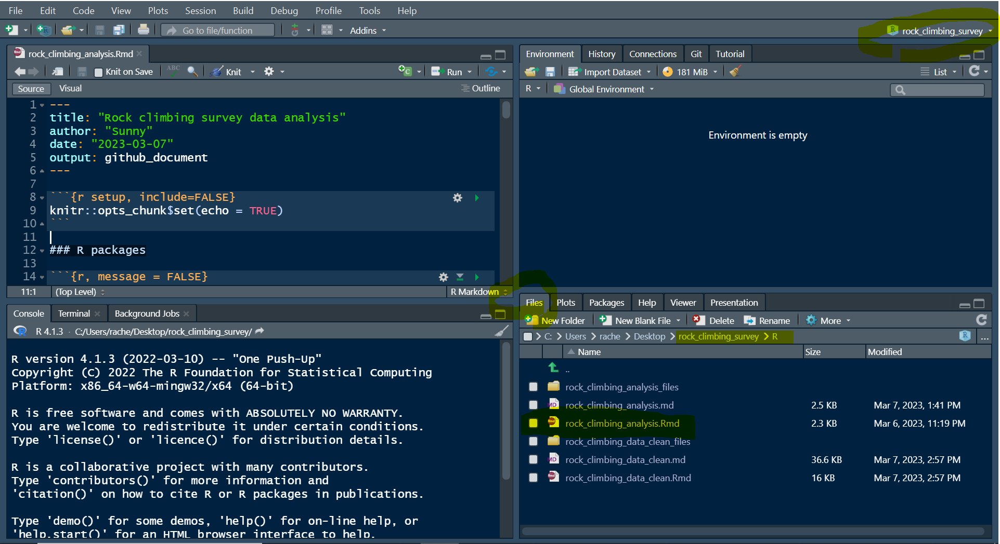

# rock_climbing_survey
Data analysis for Jenn's project in UNBC. The main analysis code is located at `R/rock_climbing_data_clean.Rmd`. 

## Preparation
- Download [R](https://cran.r-project.org/bin/windows/base/) & [R studio](https://support--rstudio-com.netlify.app/products/rstudio/download/)

- Clong, or download, this Github repository to your local computer

- Open the folder and open the **R project** file with RStudio

- After opening R Studio, you should see there is a `rock_climbing_survey` showing on the top right corner. On the bottom right corner of R Studio, click on `Folder` tab, navigate to the folder called R, and double-click an .Rmd file called `rock_climbing_data_clean.Rmd`

- An R script should pop up on your screen. Now your R Studio should have 4 windows. Top-left: your script, or code; Bottom-left: your console; Top-right: objects in the environment; Bottom-right: folders, plots, and others. 

- Congratulations! 

## Run code in R Studio

- To use a package, you will need to **install** and **load** it. Use `install.packages("PACKAGE NAME")` to download required pacakges. You only need to do it once! After this time you only need to load the package by `library("PACKAGE NAME")` eveytime you need it. 

- There are two ways you can run the code through out the script. Click `knit`, which will give you a beautiful layout report. It's often used when the project is almost finished and you need a report to show other people. Click `Run All` under the `Run` tabl will run the code in the R environment. It's often used when you are developing the project. 

- You can also run the code piece by piece by clicking on the green arrow in the code chunk. That's what I do most during developing the project. 

- Congratulations! Feel free to explore!