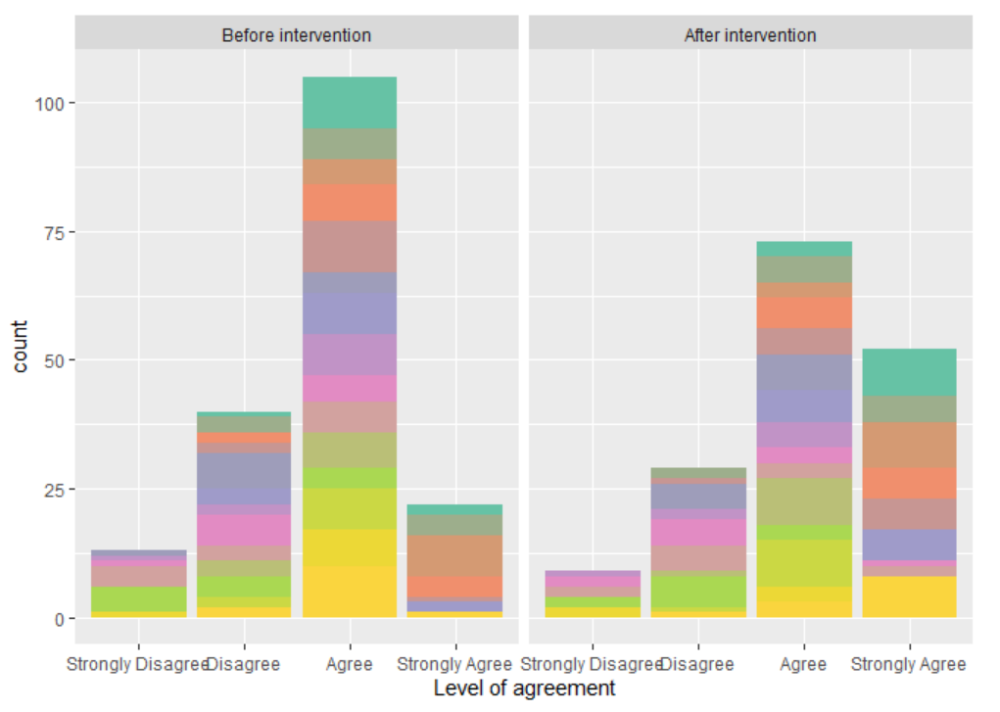
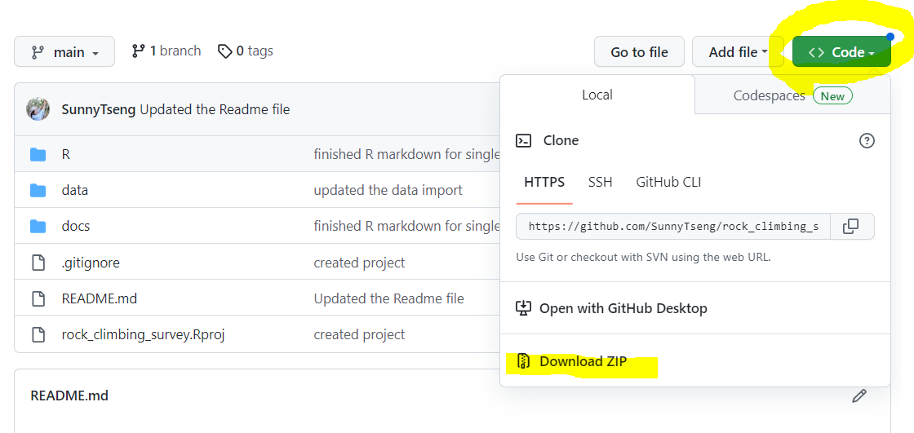

# rock_climbing_survey

There are 3 cohorts experienced rock climbing intervention. Surveys were done before intervention, after intervention, and 1-year after intervention (only for cohort 1). This research is aim to understand how the intervention would influence the behaviour of the participants. There were 20 questions asked, with 4 different levels: Strongly Agree, Agree, Disagree, Strongly Disagree.The goal of the analysis is to test whether there are significant differences between those levels before and after the intervention. 

## R codes

- [R Code for data cleaning](https://github.com/SunnyTseng/rock_climbing_survey/blob/main/R/rock_climbing_data_clean.md)

- [R code for analysis](https://github.com/SunnyTseng/rock_climbing_survey/blob/main/R/rock_climbing_analysis.md)

## Run paired Wilcoxon signed rank test

### 1. Get files ready

- Clone, or download, this Github repository to your local computer

- Open the folder and open the **R project** file with RStudio

- After opening R Studio, you should see there is a `rock_climbing_survey` showing on the top right corner. On the bottom right corner of R Studio, click on `Files` tab, navigate to the folder called R, and double-click an .Rmd file called `rock_climbing_analysis.Rmd`

- An R script should pop up on your screen. Now your R Studio should have 4 windows. Top-left: your script, or code; Bottom-left: your console; Top-right: objects in the environment; Bottom-right: folders, plots, and others. 

### Run code in R Studio

- After opening the `rock_climbing_analysis.Rmd`, run all the code by clicking the green arrow in the code chunk through out the document.

- In the final code chunk, we are analyzing the responses of single question from single cohort. Here is an example for Cohort 1, and the question "I love to climb". You should have 2 output after running the code. 

- One is the plot showing the count of difference between before & after intervention.

- The second output is a table with the statistics of the paired Wilcoxon signed rank test. Here a p-value smaller than 0.05 means the rejection of null hypothesis, meaning that the survied median of before & after interventation are not the same. 

### Only 2 values you need to change in the code

- Finally, you can change the code to analyze any questions from any cohort you want. How? By changing two things in the code (highlighted in yellow).

    - Which cohort you are looking at? Change `data_c1` to either `data_c1`, `data_c2`, or `data_c3`.

    - Which question you want to test? Change the value to the number which corresponds to the column number of the .csv file. 

- For this, I produced a [table](https://github.com/SunnyTseng/rock_climbing_survey/blob/main/R/rock_climbing_analysis.md) to show how you can input these values and their corresponding question. The table is at the very bottom of the document. 